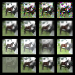
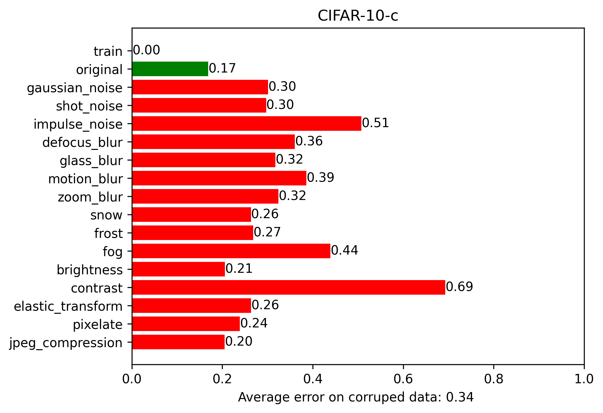

# IF5281 Deep Learning - Tugas UTS Semester II 2023/2024
Disusun oleh Muhammad Ghifary

Total nilai: 100 (tugas individu, open book/reference)


## Tantangan: Creating Robust Classifier
Buatlah sebuah model *deep learning* yang dapat melakukan klasifikasi objek visual pada dataset CIFAR-10. Model tersebut tidak hanya memiliki performa yang baik pada gambar asli pada CIFAR-10, tetapi juga mesti handal dalam mengklasifikasi gambar versi yang sudah agak dirusak (corrupted images).

Berikut penjelasan lebih lanjut mengenai dataset yang digunakan.

### CIFAR-10
CIFAR-10 merupakan dataset yang dibentuk oleh tim riset [University of Toronto](https://www.cs.toronto.edu/~kriz/cifar.html), terdiri dari 60,000 gambar RGB (50,000 train dan 10,000 test) berdimensi 32x32. CIFAR-10 memiliki 10 kelas / kategori objek: *airplane*, *automobile*, *bird*, *cat*, *deer*, *dog*, *frog*, *horse*, *ship*, *truck*.

Dataset CIFAR-10 dapat dengan mudah diakses pada PyTorch dengan menggunakan library `torchvision`.

```python
from torchvision import datasets

train_data = datasets.CIFAR10(
    ...,
    train=True,
    download=True,
    ...
)

test_data = datasets.CIFAR10(
    ...,
    train=False,
    download=True,
    ...
)
```


### CIFAR-10-C
CIFAR-10-C merupakan dataset yang dibentuk oleh ([Hendrycks and Dietterich, ICLR2019](https://arxiv.org/pdf/1903.12261v1.pdf)) untuk melakukan *benchmarking* kehandalan berbagai *deep learning classifiers* terhadap berbagai kerusakan atau *noise* pada gambar objek.

CIFAR-10-C berasal dari sampel uji CIFAR-10 yang asli, lalu diberikan variasi dengan berbagai jenis kerusakan (*corruption*) dan tingkat *severity*. Terdapat 15 jenis keruasakan dan 5 tingkatan *severity* pada dataset CIFAR-10-C.

<figure class="image">
    
    <figcaption>Sampel CIFAR-10-C untuk objek `horse`. Tipe kerusakan (dari kiri-atas ke kanan-bawah): `original`, `gaussian_noise`, `shot_noise`, `impulse_noise`, `defocus_blur`, `glass_blur`, `motion_blur`, `zoom_blur`, `snow`, `frost`, `fog`, `brightness`, `contrast`, `elastic_transform`, `pixelate`, `jpeg_compression`</figcaption>
</figure>

Dataset CIFAR-10-C dapat diakses dan diunduh dengan menggunakan [RobustBench](https://github.com/RobustBench/robustbench) ([Croce et al. NeurIPS2021](https://arxiv.org/abs/2010.09670)).

Berikut contoh pengaksesan dataset CIFAR-10-C dengan RobustBench.

`pip install git+https://github.com/RobustBench/robustbench.git`

```python
from robustbench.data import load_cifar10c

NUM_EXAMPLES = 10000
SEVERITY = 5
DATADIR = "data"
SHUFFLE = False
CORRUPTION_TYPE = "gaussian_noise"

x_test, y_test = load_cifar10c(
    NUM_EXAMPLES,
    SEVERITY, DATADIR, SHUFFLE,
    [CORRUPTION_TYPE]
)
```

## Kriteria Penilaian
Tugas Anda adalah membentuk sebuah *deep learning classifier* yang dilatih dengan *training set* dari CIFAR-10, lalu melakukan evaluasi empiris berdasarkan data uji dari CIFAR-10 itu sendiri (`original`) dan seluruh data uji pada CIFAR-10-C (dari `gaussian_noise` hingga `jpeg_compression`). Tingkat severity dari CIFAR-10-C yang digunakan adalah `SEVERITY=5`.

Anda dibebaskan untuk menggunakan strategi pelatihan model apapun, baik *training from scratch* maupun *transfer learning* menggunakan model yang sudah dilakukan pralatih.

Berikut ini kelengkapan yang akan dinilai:

- [__25 poin__] Implementasi *data preprocessing* (termasuk strategi data augmentation, jika ada) beserta penjelasannya.

- [__40 poin__] Implementasi arsitektur dan pelatihan model beserta penjelasannya.

- [__10 poin__] Visualisasi progress pelatihan (sumbu $x$: epoch, sumbu $y$: training loss dan accoracy)

- [__10 poin__] Penyajian/visualisasi hasil evaluasi (*accuracy* atau *error*) keseluruhan 

$$\mathrm{error} = 1 - \mathrm{accuracy}$$

- [__15 poin__] Jika hasil evaluasi berhasilkan mendapatkan error rata-rata pada CIFAR-10-C di bawah 0.4.

Diagram batang di bawah ini merupakan contoh hasil yang akan mendapatkan skor maksimal pada UTS ini (error rata-rata dari `gaussian_noise` hingga `jpeg_compression` $<$ 0.4).

<figure class="image">
    
    <figcaption>Contoh hasil evaluasi lengkap CIFAR-10 (`train` dan `original`) dan CIFAR-10-C (`gaussian_noise` - `jpeg_compression`)</figcaption>
</figure>

## Luaran
Luaran utama dari tugas ini adalah file jupyter notebook (`*.ipynb`) dan/atau python scripts (`*.py`) berisikan implementasi solusi dari tantangan di atas. Seluruh file utama maupun pendukung (dipersilahkan untuk menyertakan berkas-berkas lain yang dianggap perlu) disimpan dalam file zip dengan format **NIM_NAMA LENGKAP_UTSIF5281-2024.zip**.

## Waktu Pengerjaan dan Pengumpulan
Tugas ini dikerjakan dalam periode 1 hari, dikumpulkan via platform Edunex.
- Waktu mulai: **Senin, 25 Maret 2024, 13:00 WIB**
- Waktu penutupan: **Selasa, 26 Maret 2024, 12:59 WIB**


